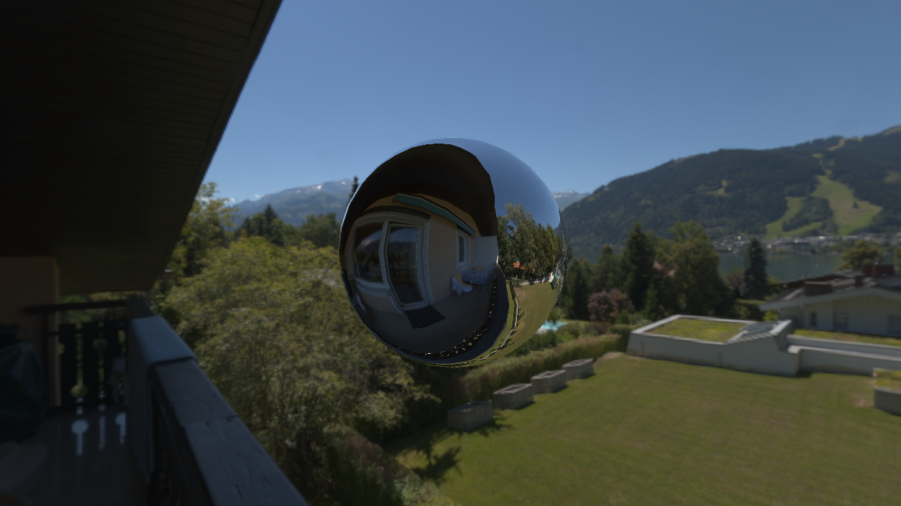
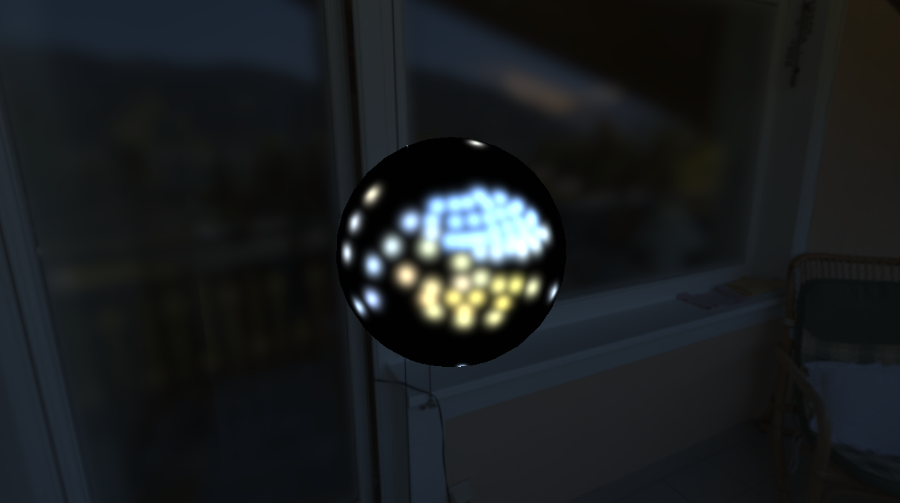

# Computer Graphics II - Median Cut Environment Lighting

<div style="display: flex;">
  
</div>

This assignment involved the application of advanced HDR environment lighting with OpenGL. Different from the previous homework, I made the decision to use C# instead C++ because I wanted to see how my favourite language would
handle the OpenGL API. I used the starter files from the open-source Silk.NET bindings, which provide functionality similar to the sampleGL files provided with the homework.

## Equilateral HDR image to cubemap texture

The first step is getting our .hdr to the correct format. We have one image that represents the entire sky, but we need 6 separate images for each direction. There are multiple methods of achieving this conversion. I went with the method
where one renders a fullscreen quad 6 times for each direction. A special fragment shader is used to sample the .hdr. This shader calculates what color each pixel in each face should be by looking at the input HDRI. After this processing is complete, we have a cubemap texture ready for environment rendering.

## Skybox Rendering

To make our scene look bigger than it actually is, a technique is applied named skybox rendering. A cube is rendered as if its size is infinite, behind everything else in the scene. The previously generated cubemap texture is applied to this cube. This makes the environment look much more realistic. But we need to also make sure that the objects in the scene are lit in a believable manner by the skybox. This
brings us to the next section.

## Median Cut Algorithm

We need to light the objects in the scene according to the skybox texture. However, it would be intractable to sample every pixel in the skybox for each fragment of each object. Therefore, an approximation technique is used here. The median cut algorithm allows the generation of a set number of directional lights that when applied on a given object, approximate the actual light the skybox would cast. 

The steps of the algorithm can be summarized as follows:
1. Generate a summed area table for fast area sum lookups on the original HDR.
2. Divide the region (at first the entire image) into two regions, such that each region has the same total light energy.
3. Add to the list of output lights, a light with position equal to the centroid of the region and color equal to the sum color of that region.
4. For sub-region 1, go to step 2 recursively.
5. For sub-region 2, go to step 2 recursively.

The recursion may be stopped when the desired number of lights is reached.

```csharp
private void Calculate(Vector2D<int> TL, Vector2D<int> BR, int level)
{
   if (level >= LevelCount) return;

   // Calculate x-axis midline
   Vector2D<int> leftRegionBR = new(TL.X, BR.Y);
   Vector2D<int> rightRegionTL = new(TL.X + 1, TL.Y);
   while (leftRegionBR.X < BR.X)
   {
       float leftSum = Luminance(GetAreaSum(TL, leftRegionBR));
       float rightSum = Luminance(GetAreaSum(rightRegionTL, BR));
       if (leftSum >= rightSum)
           break;

       leftRegionBR.X++;
       rightRegionTL.X++;
   }

   // Calculate y-axis midline
   Vector2D<int> topRegionBR = new(BR.X, TL.Y + 1);
   Vector2D<int> bottomRegionTL = new(TL.X, TL.Y + 1);
   while (topRegionBR.Y < BR.Y)
   {
       float topSum = Luminance(GetAreaSum(TL, topRegionBR));
       float bottomSum = Luminance(GetAreaSum(bottomRegionTL, BR));
       if (topSum >= bottomSum)
           break;

       topRegionBR.Y++;
       bottomRegionTL.Y++;
   }

   // Add light to centroid of region
   Vector2 centroid = new((leftRegionBR.X + rightRegionTL.X) / 2.0f, (topRegionBR.Y + bottomRegionTL.Y) / 2.0f);
   Light light = new(GetLightWorldPosition(centroid), GetAreaSum(TL, BR));
   lightingData[level].Add(light);

   int width = BR.X - TL.X;
   int height = BR.Y - TL.Y;

   // Divide based on which dimension is longer
   if (width > height)
   {
       Calculate(TL, leftRegionBR, level + 1);
       Calculate(rightRegionTL, BR, level + 1);
   }
   else
   {
       Calculate(TL, topRegionBR, level + 1);
       Calculate(bottomRegionTL, BR, level + 1);
   }
}
```

## Render Modes

To showcase the capabilities of the environment rendering, there are five distinct render modes. 

1. Light Probe - the generated directional lights are used to calculate diffuse and specular shading on the object.
2. Glass - the camera incident direction is refracted according to the object normal and then sampled, with a glass-like result.
3. Mirror - the camera incident direction is reflected according to the object normal and then sampled on the skybox resulting in a reflective look.
4. Glossy - combination of Light Probe and Mirror modes.
5. Specular Disco - fun debug mode where the algorithm lights are used to calculate only specular and with a very high exponent. Image below.

<div style="display: flex;">
  
</div>

## Tonemapping

Since we are doing every step of the rendering with HDR before displaying the results we have to apply a tonemapping algorithm. This is done by first rendering the scene to an off-screen buffer, then doing an extra render pass where we render a fullscreen quad. The tonemapping is done in this render pass's fragment shader. The fragment shader samples the input HDR scene and writes to the LDR framebuffer. This framebuffer is then displayed on the screen. 

The tonemapping may be simply described as scaling the scene RGB values based on the average RGB value of the scene. So if the scene contains very high color values the average will also be very high, thus the scaling will still output values within the same range.

A key point here is how the average luminance is obtained. If we were running this on the CPU we could loop through the image and calculate the average directly, but this is not how shaders work. The trick used here is mipmapping. Mipmapping is a hardware feature where we can have lower resolution versions of the same image. Figuratively an image pyramid is formed, each level having half the resolution of the previous level. The last level has a resolution of 1x1 and contains the average color of the buffer. So we can just sample the last level mipmap to obtain the average color.

The fragment shader is given below for reference:

```glsl
float luminance(vec4 color) {
    const vec3 weights = vec3(0.2126, 0.7152, 0.0722);
    return dot(color.rgb, weights);
}

void main(void)
{
    const float gamma = 2.2;
    vec4 oneSample = exp(textureLod(hdrInput, texCoord, 10));
    float mean = luminance(oneSample);

    vec3 hdrColor = exp(texture(hdrInput, texCoord)).rgb / mean;
    hdrColor *= exposure;
  
    vec3 mapped = hdrColor;
    mapped = pow(mapped, vec3(1.0 / gamma));
  
    FragColor = vec4(mapped, 1.0);
}
```
